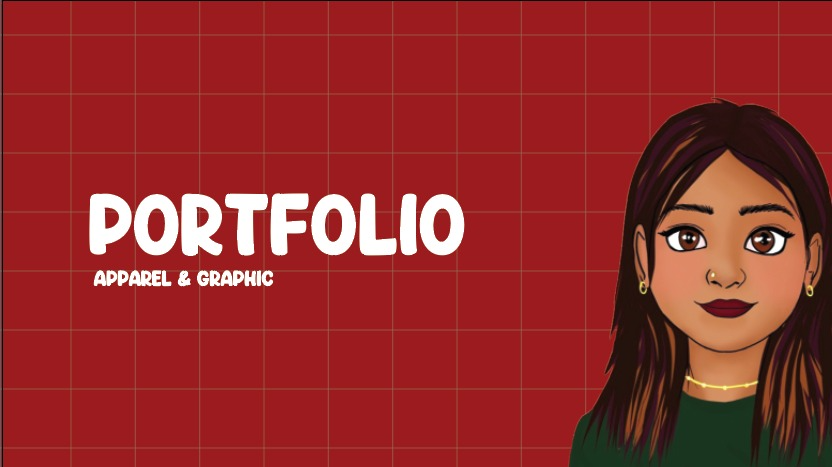

# Vaishaly S — Apparel Designer Portfolio
# 🌿 Vaishaly S — Portfolio Website
# HOW TO UPDATE YOUR WEBSITE
### A step-by-step guide written for non-technical people

---

> **You don't need to know coding to update this website.**
> This guide will walk you through every single step, one at a time.
> Think of it like following a recipe — just read each step carefully and do exactly what it says.

---

## 📋 TABLE OF CONTENTS

1. [How to open and preview your website](#1-how-to-open-and-preview-your-website)
2. [How to add your profile photo](#2-how-to-add-your-profile-photo)
3. [How to add the hero background image](#3-how-to-add-the-hero-background-image)
4. [How to add your resume PDF](#4-how-to-add-your-resume-pdf)
5. [How to add portfolio images to a project](#5-how-to-add-portfolio-images-to-a-project)
6. [How to add a brand new project to the portfolio](#6-how-to-add-a-brand-new-project-to-the-portfolio)
7. [How to change your name, email or phone number](#7-how-to-change-your-name-email-or-phone-number)
8. [How to add your LinkedIn or Instagram](#8-how-to-add-your-linkedin-or-instagram)
9. [How to put your website live on the internet (GitHub Pages)](#9-how-to-put-your-website-live-on-the-internet-github-pages)
10. [Where everything is stored on your computer](#10-where-everything-is-stored-on-your-computer)
11. [Image tips and sizes](#11-image-tips-and-sizes)

---

## 1. How to open and preview your website

Your website is stored as files on your computer. You can open it like opening a Word document.

**Steps:**
1. Open the folder called **`vaishaly-portfolio`** (it is saved at `C:\Users\rh2\vaishaly-portfolio`)
2. Find the file called **`index.html`**
3. **Double-click** it
4. It will open in your web browser (Chrome, Edge, etc.)
5. You will see your portfolio website!

> **Tip:** Every time you make a change, save the file, then press **F5** in your browser to refresh and see the update.

---

## 2. How to add your profile photo

This is the photo that appears in the **"About Me"** section.

**Steps:**

**Step 1 — Prepare your photo**
- Use a clear, professional photo of yourself
- Any photo from your phone or camera will work
- Rename the photo file to exactly: **`portrait.jpg`**
  - (Right-click the photo → Rename → type `portrait.jpg`)

**Step 2 — Copy the photo to the right folder**
1. Open File Explorer (press Windows key + E)
2. Go to: `C:\Users\rh2\vaishaly-portfolio\assets\images\about\`
3. Paste your **`portrait.jpg`** file into that folder
4. Delete the file called `REPLACE_THIS.txt` (you no longer need it)

**Step 3 — Tell the website to use your photo**
1. Go to: `C:\Users\rh2\vaishaly-portfolio\`
2. Right-click the file called **`index.html`**
3. Choose **"Open with"** → **Notepad** (or any text editor)
4. Press **Ctrl + F** on your keyboard — a "Find" box will appear
5. Type this into the Find box and press Enter:
   ```
   img-placeholder img-placeholder--portrait
   ```
6. You will see a big block of code that looks like this:
   ```html
   <div class="img-placeholder img-placeholder--portrait">
     <div class="ph-inner">
       ...lots of lines...
     </div>
   </div>
   ```
7. Select **everything** from `<div class="img-placeholder` down to and including the matching `</div>` that closes it
8. Delete it all
9. In that exact same place, type this one line:
   ```html
   
   ```
10. Press **Ctrl + S** to save
11. Refresh your browser — your photo will now appear!

---

## 3. How to add the hero background image

This is the large full-screen image behind the words **"Turning Trends Into Commercial Product."** on the homepage.

**Best photo for this:** A fashion or garment photograph — a lookbook image, a flat-lay of garments, a studio image, or anything that looks editorial and professional. Dark or moody images work especially well because the text appears on top.

**Steps:**

**Step 1 — Prepare your image**
- Rename your image file to: **`hero.jpg`**

**Step 2 — Copy it to the right folder**
1. Go to: `C:\Users\rh2\vaishaly-portfolio\assets\images\hero\`
2. Paste your **`hero.jpg`** file there
3. Delete `REPLACE_THIS.txt`

**Step 3 — Tell the website to use it**
1. Open `index.html` in Notepad (right-click → Open with → Notepad)
2. Press **Ctrl + F** and search for:
   ```
   hero-bg-img
   ```
3. You will see two lines near each other. One is commented out (has `<!--` and `-->` around it). Find this line:
   ```html
   <!--  -->
   ```
4. Delete the `<!--` from the start and `-->` from the end of that line so it becomes:
   ```html
   
   ```
5. Now find the large block that starts with `<div class="hero-bg-placeholder">` — select everything from that line down to its closing `</div>` and delete it
6. Press **Ctrl + S** to save
7. Refresh your browser

---

## 4. How to add your resume PDF

**Steps:**

1. Find your resume PDF file on your computer
2. Rename it to: **`resume.pdf`**
3. Go to: `C:\Users\rh2\vaishaly-portfolio\assets\`
4. Paste your **`resume.pdf`** file there
5. Delete `PLACE_RESUME_HERE.txt`

That's it! The "Download Resume" and "View Resume" buttons on your website will automatically work.

---

## 5. How to add portfolio images to a project

Each project on your website has its own folder for images.

**Example: Adding images to the Nautica Kidswear project**

**Step 1 — Create the project image folder**
1. Go to: `C:\Users\rh2\vaishaly-portfolio\assets\images\portfolio\`
2. Create a new folder here called: **`nautica-kidswear-ss25`**
   - (Right-click inside the folder → New → Folder)

**Step 2 — Add your images**
1. Copy your project photos into that folder
2. Name the main/cover photo: **`cover.jpg`**
3. Name the others anything you like, e.g.: `moodboard.jpg`, `sketch-1.jpg`, `final-1.jpg`

**Step 3 — Tell the website about the images**
1. Open the file: `C:\Users\rh2\vaishaly-portfolio\js\data.js`
   - Right-click → Open with → Notepad
2. Press **Ctrl + F** and search for: `nautica-kidswear-ss25`
3. Find the line that says:
   ```
   coverImage: '',
   ```
4. Change it to:
   ```
   coverImage: 'assets/images/portfolio/nautica-kidswear-ss25/cover.jpg',
   ```
5. Find the section that says:
   ```
   images: [
   ```
6. Inside the `[` and `]`, add your gallery photos in this format (one per photo):
   ```
   {
     src: 'assets/images/portfolio/nautica-kidswear-ss25/moodboard.jpg',
     alt: 'Nautica Kidswear — Moodboard',
     fit: 'contain',
   },
   {
     src: 'assets/images/portfolio/nautica-kidswear-ss25/final-1.jpg',
     alt: 'Nautica Kidswear — Final Product',
     fit: 'cover',
   },
   ```
   > **Tip about `fit`:**
   > - Use `'contain'` for flat sketches, tech packs or drawings (shows the full image without cutting anything off)
   > - Use `'cover'` for garment photographs (fills the space nicely)

7. Press **Ctrl + S** to save
8. Refresh your browser — your images will now appear!

---

## 6. How to add a brand new project to the portfolio

**Step 1 — Open the data file**
1. Open: `C:\Users\rh2\vaishaly-portfolio\js\data.js` in Notepad

**Step 2 — Find the template**
1. Press **Ctrl + F** and search for: `your-project-id`
2. You will see a large commented-out block starting with `//`
3. That is your template — copy everything from `//` to the last `//,`

**Step 3 — Add a new project**
1. Scroll up in the file and find the last real project — it ends with `},`
2. After that last `},` (on a new line), paste your copied template
3. Remove all the `//` comment symbols from the start of each line in your pasted block
4. Fill in the details:

   | Field | What to put |
   |---|---|
   | `id:` | A unique short name with hyphens, no spaces. E.g. `'my-new-project'` |
   | `title:` | The full project name in quotes. E.g. `'Gap Menswear SS26'` |
   | `category:` | Choose one: `'womenswear'`, `'menswear'`, `'kidswear'`, `'technical'`, `'tech-packs'`, `'trend-concept'`, `'graphic-print'`, or `'accessories'` |
   | `brand:` | The brand name |
   | `season:` | E.g. `'SS26'` or `'AW25'` |
   | `year:` | E.g. `'2026'` |
   | `role:` | Your job title on this project |
   | `company:` | Where you were working |
   | `featured:` | `true` to show on homepage, `false` to keep in portfolio only |
   | `description:` | A short paragraph about the project |

5. Press **Ctrl + S** to save
6. Add images (follow the steps in section 5 above)
7. Refresh your browser to see the new project card!

---

## 7. How to change your name, email or phone number

**Step 1**
1. Open: `C:\Users\rh2\vaishaly-portfolio\js\data.js` in Notepad

**Step 2**
1. At the very top of the file, you will see:
   ```javascript
   const siteConfig = {
     name:     'Vaishaly S',
     title:    'Apparel Designer',
     email:    'svaishaly.1@gmail.com',
     phone:    '+91 7397310071',
     location: 'Bangalore, India',
   ```
2. Change any value by clicking on the text inside the single quote marks `' '` and typing your update
3. Press **Ctrl + S** to save

> **Important:** The email and phone in the contact section of the website are hardcoded in `index.html` as well. If you change your email, also open `index.html`, press **Ctrl + H** (Find and Replace) and replace `svaishaly.1@gmail.com` with your new email address.

---

## 8. How to add your LinkedIn or Instagram

**Step 1 — Add the links in the data file**
1. Open: `C:\Users\rh2\vaishaly-portfolio\js\data.js` in Notepad
2. At the top, find:
   ```javascript
   linkedin:  '',
   instagram: '',
   ```
3. Add your profile link inside the quotes, for example:
   ```javascript
   linkedin:  'https://linkedin.com/in/vaishaly-s',
   instagram: 'https://instagram.com/your_username',
   ```
4. Save the file (Ctrl + S)

**Step 2 — Show the links on the website**
1. Open `index.html` in Notepad
2. Press **Ctrl + F** and search for: `linkedin.com/in/YOURPROFILE`
3. You will find two rows that look like:
   ```html
   <!--
   <div class="contact-row">
     <span class="contact-label">LinkedIn</span>
     ...
   </div>
   -->
   ```
4. Remove the `<!--` from the top and `-->` from the bottom of each social row you want to show
5. Replace `YOURPROFILE` with your actual LinkedIn profile name
6. Save (Ctrl + S) and refresh your browser

---

## 9. How to put your website live on the internet (GitHub Pages)

GitHub Pages is a **free** hosting service. This makes your website available to anyone in the world with a link.

**What you need:** A free GitHub account (sign up at [github.com](https://github.com))

**Steps:**

**Step 1 — Create a GitHub account**
1. Go to [https://github.com](https://github.com)
2. Click "Sign up" and follow the steps
3. Choose a username — this will become part of your website address!
   - e.g. if your username is `vaishaly-s`, your website will be at `https://vaishaly-s.github.io`

**Step 2 — Create a new repository (this is just a project folder on GitHub)**
1. After signing in, click the **+** button at the top right
2. Click **"New repository"**
3. Name it exactly: `yourusername.github.io` (replace "yourusername" with your GitHub username)
   - Example: `vaishaly-s.github.io`
4. Keep it **Public**
5. Click **"Create repository"**

**Step 3 — Upload your website files**
1. On the next screen, click **"uploading an existing file"**
2. Open your `vaishaly-portfolio` folder on your computer
3. Select ALL the files and folders inside it (press Ctrl + A to select all)
4. Drag them into the GitHub upload window
5. Wait for them to upload (this may take a few minutes)
6. Scroll down and click **"Commit changes"**

**Step 4 — Turn on GitHub Pages**
1. Click the **"Settings"** tab at the top of your repository
2. In the left menu, click **"Pages"**
3. Under "Source", select **"Deploy from a branch"**
4. Under "Branch", choose **"main"** and keep the folder as **"/ (root)"**
5. Click **"Save"**
6. Wait 2–5 minutes, then refresh the Settings → Pages screen
7. You will see a green box saying **"Your site is published at https://yourusername.github.io"**
8. Click that link — your website is live! 🎉

**Step 5 — Update the website URL in your data file**
1. Open `C:\Users\rh2\vaishaly-portfolio\js\data.js` in Notepad
2. Find the line: `siteUrl: 'https://yourusername.github.io',`
3. Replace `yourusername` with your actual GitHub username
4. Save and re-upload the file to GitHub (repeat Step 3 for just this one file)

> **To update your website after making changes:**
> Just go back to your GitHub repository, click "Add file" → "Upload files", and upload the changed files again. GitHub will automatically update your live website within a few minutes.

---

## 10. Where everything is stored on your computer

```
vaishaly-portfolio/
│
├── 📄 index.html          ← The main website file. Rarely need to edit.
│
├── 📁 css/
│   ├── style.css          ← Controls how the website looks (colours, fonts, spacing)
│   └── animations.css     ← Controls the animations
│
├── 📁 js/
│   ├── ✅ data.js         ← THIS IS YOUR MAIN EDITING FILE. Change text and project info here.
│   └── main.js            ← Technical logic. Do not edit.
│
├── 📁 assets/
│   ├── 📄 resume.pdf      ← PUT YOUR RESUME PDF HERE (rename it to resume.pdf)
│   └── 📁 images/
│       ├── 📁 hero/       ← PUT YOUR HERO BACKGROUND IMAGE HERE (rename to hero.jpg)
│       ├── 📁 about/      ← PUT YOUR PORTRAIT PHOTO HERE (rename to portrait.jpg)
│       └── 📁 portfolio/  ← PUT PROJECT IMAGES HERE (one subfolder per project)
│           ├── nautica-kidswear-ss25/
│           │   ├── cover.jpg
│           │   └── moodboard.jpg
│           └── (your other project folders)
│
└── 📄 README.md           ← This guide (the file you are reading right now)
```

**Golden rule:**
> Only ever edit the file `js/data.js` for text content.
> Only ever put image files into the `assets/images/` subfolders.
> Never rename or move `index.html`, `css/`, or `js/main.js`.

---

## 11. Image tips and sizes

| What the image is for | Best format | Recommended size |
|---|---|---|
| Hero background | `.jpg` or `.webp` | 1920 × 1080 pixels or bigger |
| Your portrait / headshot | `.jpg` | 800 × 1000 pixels |
| Project cover photo | `.jpg` or `.webp` | 1200 × 800 pixels |
| Flat sketches / drawings | `.jpg` or `.png` | Any size — use `fit: 'contain'` |
| Tech packs | `.jpg` or `.png` | Any size — use `fit: 'contain'` |
| Moodboards | `.jpg` | Any size |
| Animated concepts | `.gif` | Keep file size under 5MB |

**`fit: 'contain'` vs `fit: 'cover'` — what does this mean?**
- `'contain'` = The whole image is shown. Nothing gets cropped. Great for sketches and tech packs.
- `'cover'` = The image fills the frame. May crop edges slightly. Great for fashion photography.

**How to rename an image file:**
1. Find the image on your computer
2. Right-click it
3. Click **"Rename"**
4. Type the new name (including the extension, e.g. `.jpg`)
5. Press Enter

---

## ❓ Something went wrong?

**The website looks broken after I made a change:**
- Open the file you edited in Notepad
- Press **Ctrl + Z** several times to undo your changes
- Save the file and refresh your browser

**The image is not showing:**
- Check the file name is spelled exactly the same in the folder AND in `data.js`
- Spelling and UPPER/lowercase matter: `Cover.jpg` is different from `cover.jpg`
- Make sure the image is inside the correct folder

**The "Download Resume" button does nothing:**
- Check that your file is named exactly `resume.pdf`
- Check that it is inside the `assets/` folder (not inside `assets/images/`)

---

*Portfolio website designed and built for Vaishaly S, Apparel Designer · Bangalore, India*
